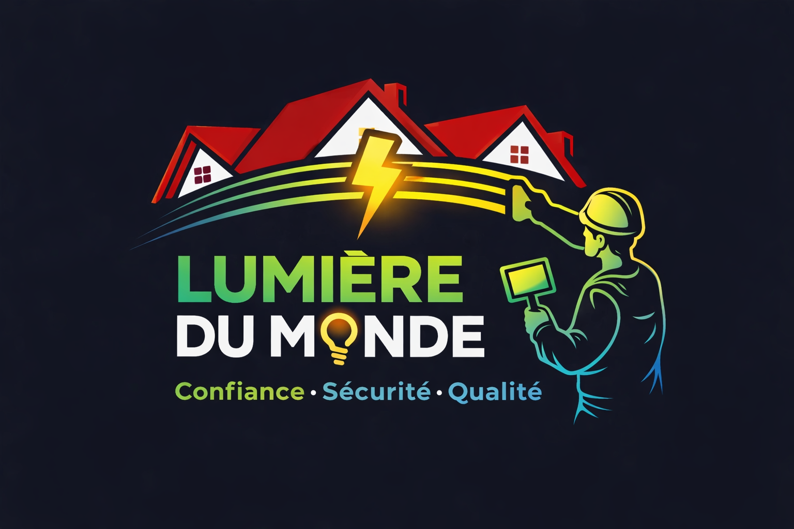

<!DOCTYPE html>

<html lang="fr">
<head>
    <meta charset="UTF-8">
    <title>Lumière du Monde</title>
    <meta name="viewport" content="width=device-width, initial-scale=1.0">

    
</head>

<body>

<header>
    <!-- LOGO -->
    
    
    <h1>LUMIÈRE DU MONDE</h1>
    
Votre expert en électricité

</header>

<section>
    <h2>Nos services</h2>

    

        ⚡ Installation électrique (hôpital, hôtel, appartements)
    

    

        🔧 Dépannage rapide
    

    

        💡 Conseils en électricité
    

    

        🔌 Séparation de compteur
    

</section>

<section>
    <h2>Contact</h2>
    
📞 +243 990 916 670

    
📍 Goma, RDC

    <a class="btn" href="tel:+243990916670">Appeler maintenant</a>
</section>

<footer>
    
© 2026 Lumière du Monde - Tous droits réservés

</footer>

</body>
</html>
